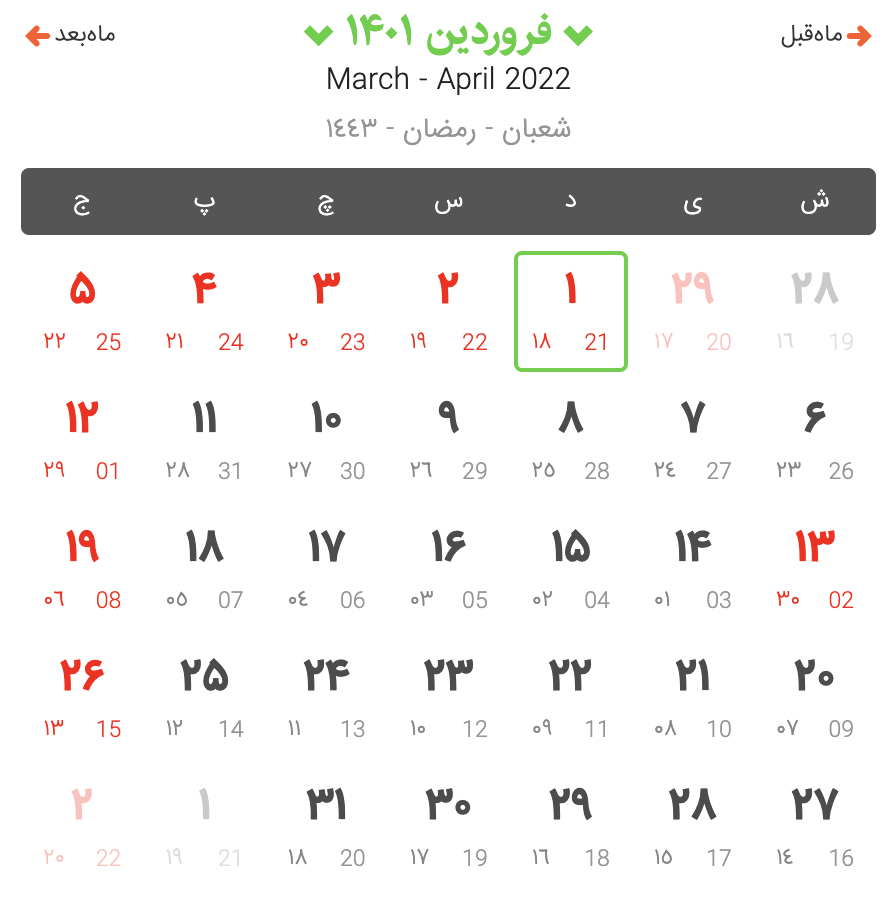

Links: [Private Plans](https://github.com/arm-on/privateplans/blob/main/README.md) | [Temporary Note](https://github.com/arm-on/privateplans/blob/main/temp.md) |

Headlines:

[Important Dates](#important-dates) | [Goals](#goals) | [Rules](#rules) | [Tasks](#tasks) | [PhD Thesis](#phd-thesis) | [Work](#work) | [Youtube](#youtube) | [Instagram](#instagram) | [Languages](#languages) | [DJ](#dj)

# Important Dates
[-Back to top-](#)

<table style="width:100%">
  <tr>
    <th>Account</th>
    <th>Deadline</th>
    <th>Note</th>
  </tr>
  <tr>
    <td>Google Drive</td>
    <td>November 14th, 2022</td>
    <td></td>
  </tr>
  <tr>
    <td>Google Colab</td>
    <td>Until Further Notice</td>
    <td></td>
  </tr>
    <tr>
    <td>Busuu</td>
    <td>December 7th, 2022</td>
    <td></td>
  </tr>
    <tr>
    <td>Mihanwebhost</td>
    <td></td>
    <td></td>
  </tr>
  <tr>
  <td>
  Vaccination (3rd Dose)
  </td>
  <td>23 Day, 1400</td>
  <td></td>
  </tr>
  <tr>
  <td>
  Rakuten Viki
  </td>
  <td>17 Esfand</td>
  <td></td>
  </tr>
  <tr>
  <td>
  IEEE
  </td>
  <td>31 December 2022</td>
  <td></td>
  </tr>
  <tr>
  <td>
  Server HPC
  </td>
  <td>24 Esfand</td>
  <td></td>
  </tr>
</table>

# Goals
[-Back to top-](#)
- [Long-term](long-term-goals.md)
- [Short-term](short-term-goals.md)

# Rules
[-Back to top-](#)
- [General](rules-and-points.md)

# Tasks
[-Back to top-](#)

|Task|Deadline|Notes|Status|
|-|-|-|-|
|ML Theory for YT - S1&2 (Re-upload)|30 Bahman|-|:white_check_mark:|
|Data poisoning paper (Read & Summarize)|1 Esfand|Attacks remaining - Min-max, influence, and KKT|:white_check_mark:|
|Predictive Inference paper (Read & Summarize)|2 Esfand|-|:white_check_mark:|
|German Bamboo - Lesson 1|2 Esfand|-|:white_check_mark:|
|Group Announcement (Record Voices)|3 Esfand|-|:white_check_mark:|
|In-n-out paper (Read & Summarize)|3 Esfand|-|:white_check_mark:|
|Adding noise to the CV dataset|5 Esfand|-|:x:|
|ML Theory for YT - S3|6 Esfand|-|:white_check_mark:|
|Reading the [Data Papers](ongoing/confpaper.md)|7 Esfand|-|:white_check_mark:|
|ML Theory - S4|-|-|:white_check_mark:|
|ML Theory for YT - S4|-|-|-|
|Reading the In-n-Out Paper - Proofs|12 Esfand|-|-|
|Try to defend against the novel data sanitization attacks (Find new papers)|12 Esfand|-|-|
|Finding the structure of the crawled datasets|20 Esfand|-|-|
|-|-|-|-|
|-|-|-|-|
|-|-|-|-|
|-|-|-|-|

Status types: :white_check_mark:, :hammer:, :x:

- [Long-term](long-term-tasks.md)
- [Short-term](short-term-tasks.md)
- Temporary
  

Ongoing

- [Youtube](#youtube)
- [Languages](#languages)
- [Data Papers](ongoing/confpaper.md)
- Machine Learning Theory
- Reading Papers to Write a Research Proposal for my PhD (Postponed until the end of the exams)
- [Kaggle](#kaggle)

On Hold:

- Django
- Android + Kotlin
- [Cooking](ongoing/cooking.md)
- Docker
- [Information Theory](ongoing/inf.md)
- [Work](#work)

# PhD Thesis
[-Back to top-](#)
- Papers to read:
  - Stronger Data Poisoning Attacks Break Data Sanitization Defenses
  - Predictive Inference with Weak Supervision
  - In-n-out: Pre-traning and self-training using auxiliary information for out-of-distribution robustness

# Youtube
[-Back to top-](#)
## AINT
- Channel Intro Video
- Probability and Statistics
    - Dirichlet distribution
    - Marginal probability
    - Covariance (p. 29)
    - Central Limit Theorem
    - Markov inequality
    - Chebishev's ineq. 
    - Law of large numbers
    - MAP (parameter estimation)
    - p-value
    - confidence interval
    - joint distribution
    - correlation
    - Example of the Multivariate Normal Distribution
- Schedule: 0/1 video per week (at least)

## AINT (Persian)
- Channel Intro Video
- ML Theory
- Pytorch series
- Tensorflow series
- Uncomplicated videos
  - What is Machine Learning?
  - Interview Questions
  - 
- Schedule: 2/3 videos per week (at least) --> 1 ML-Theory video + 1 Pytorch/TF video + 1 simpler

# Instagram
[-Back to top-](#)
## Persian
- Hot topics:
  - Application Introduction (e.g., task management apps)
  - Tricks (tarfand)
  - Simpler explanations of AI & ML concepts (for regular audience)
  - Youtube course announcements (e.g., High-dim Stats course released)
  - AI news
## English (and also for the English facebook)
- Youtube english course announcements
- English version of the Persian content

# Languages 

[-Back to top-](#)

‌[Busuu Buy Link](https://license-market.ir/product/Busuu)

emails: malekzadeh@ieee.org

<table style="width:100%">
  <tr>
    <th>Language</th>
    <th>Status</th>
    <th>Note</th>
  </tr>
  <tr>
    <td><a href="https://www.youtube.com/watch?v=2w7JiKuNrQM&list=PLfvO0lX1t_WxJNjeKU1pj-dW4TDEZd_Lg">German - Bamboo</a></td>
    <td>Next: Lesson 2</td>
    <td></td>
  </tr>
  <tr>
    <td><a href="https://www.youtube.com/watch?v=Dbv79prOMEk&list=PLAeu18HndGgBR-QLw8b8Wzp0gLiVfCS7n&index=1">Dutch (Learn dutch with Kim on Youtube)</a></td>
    <td>Being started</td>
    <td></td>
  </tr>
</table>

# Work
[-Back to top-](#)

- Adding noise to the code run by ADM
- 

# DJ
[-Back to top-](#)
- To do:
  - making a library of songs in different genres, having various rhythms (in Persian / English)

# Kaggle
[-Back to top-](#)
